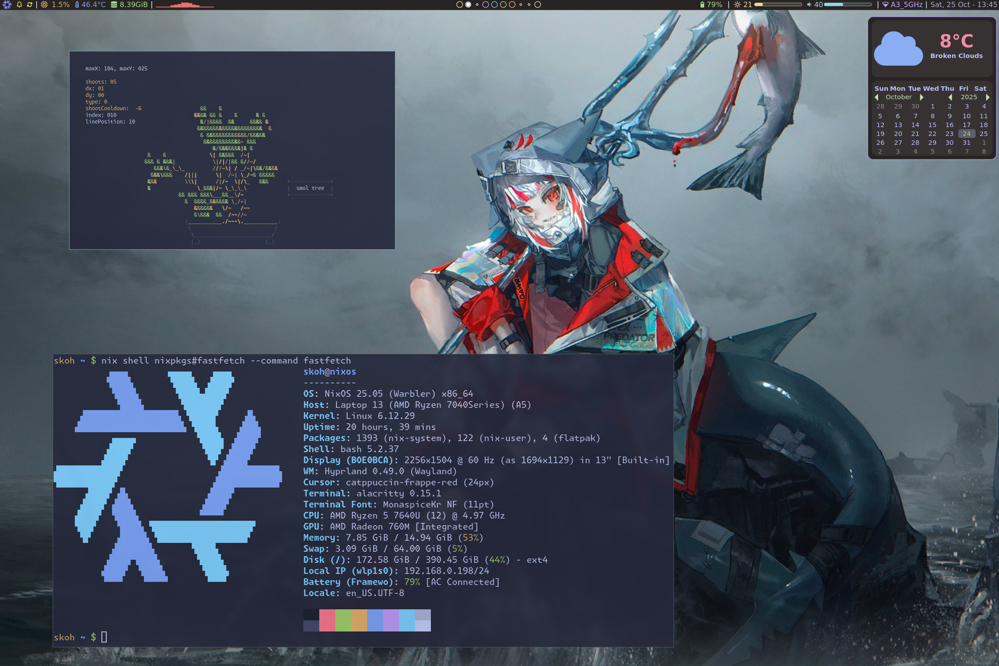

# Laptop config

## Config files
[`config`](./config/) -> Dotfiles 
[`nixos`](./nixos/) -> OS config 
[`scripts`](./scripts/) -> Bash scripts 

## Misc
[`icons`](./icons/) -> Mouse cursor 
[`wallpapers`](./wallpapers/) -> Background wallpapers 
[`xkb`](./xkb/) -> Keyboard config
